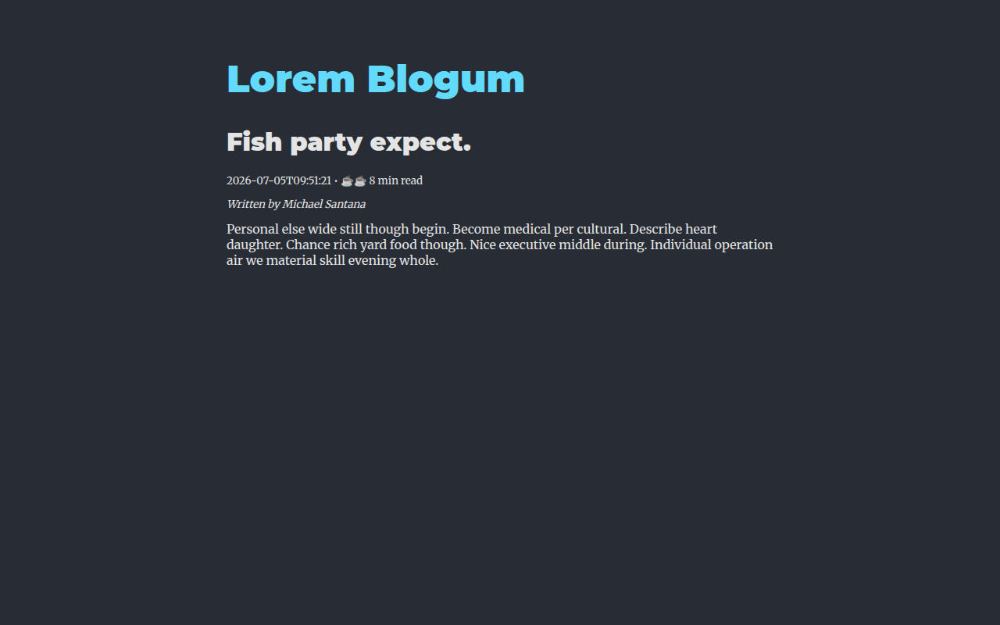
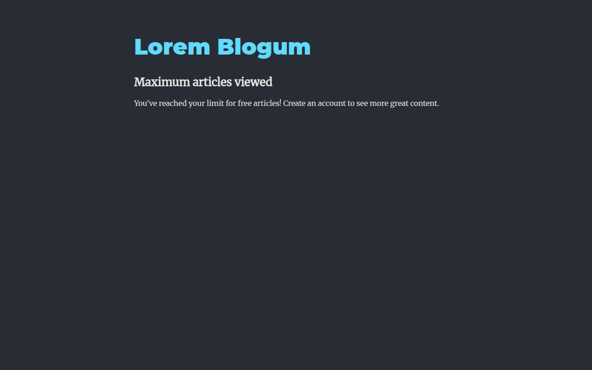

# Lorem Blogum — Blog Paywall with Flask Sessions

A full-stack blog application with a backend-enforced paywall. Readers can view
**three free articles**; every article view is counted server-side in the Flask
`session`, and once the limit is reached the API responds with a
`401 Unauthorized` and the React frontend displays a paywall.

## Description

The paywall limit was previously enforced only in the frontend, which meant
tech-savvy readers could bypass it with browser dev tools. This application
moves that logic to the backend:

- Every `GET /articles/<id>` request increments `session['page_views']`.
- The session cookie is cryptographically signed by Flask, so the counter
  can't be tampered with from the browser.
- Views 1–3 return the article JSON; from the 4th view onward the API returns
  `401` with `{"message": "Maximum pageview limit reached"}` and the frontend
  renders the paywall instead of the article.

**Tech stack:** Flask, Flask-SQLAlchemy, Flask-Migrate, Marshmallow, SQLite,
React (Create React App), React Router.

## Visuals

Reading an article (views 1–3):



The paywall after the third article (view 4+):



## Installation

Requires Python 3.8+, pipenv, and Node.js.

```bash
pipenv install && pipenv shell
npm install --prefix client
cd server
flask db upgrade
python seed.py
```

## Usage

Run the Flask API (from the `server/` directory):

```bash
python app.py
```

In a second terminal, run the React app:

```bash
npm start --prefix client
```

Then open [http://localhost:4000](http://localhost:4000), click into articles,
and after three article views the paywall appears.

### API Endpoints

| Method | Endpoint | Description |
| --- | --- | --- |
| GET | `/articles` | List all articles. |
| GET | `/articles/<id>` | Show one article and count the view. Returns `401` with `{"message": "Maximum pageview limit reached"}` after 3 views. |
| GET | `/clear` | Reset the session's view counter (handy while testing). |

### Running the tests

```bash
pytest
```

The suite verifies the article show route, the session counter incrementing on
every view, and the `401` paywall response after three views.

## Contributing

See [CONTRIBUTING.md](CONTRIBUTING.md).

## License

See [LICENSE.md](LICENSE.md).
